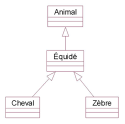

# La relation de généralisation/spécialisation

La relation de généralisation/spécialisation est l'association entre deux objets permettant d'exprimer que l'un est plus général que l'autre et inversement.

En développement informatique, on parle de relation d'héritage (un objet "hérite" d'un autre objet).

Dans un diagramme, cette relation est représenté par une flêche entre les 2 objets.

Exemple : 

Ci-dessus est représenté une hiérarchie d'objets (en réalité une hiérarchie de classes).

L'animal est l'objet le plus général.

Un équidé est un animal
- `Équidé` est une spécialisation d'`Animal`.
- `Équidé` hérite d'`Animal`.

Un cheval est un équidé
- `Cheval` est une spécialisation d'`Équidé`.
- `Cheval` hérite d'`Équidé`.
- Par extension, un `Cheval` est un `Animal`.

Un zèbre est un équidé
- `Zèbre` est une spécialisation d'`Équidé`.
- `Zèbre` hérite d'`Équidé`.
- Par extension, un `Zèbre` est un `Animal`.